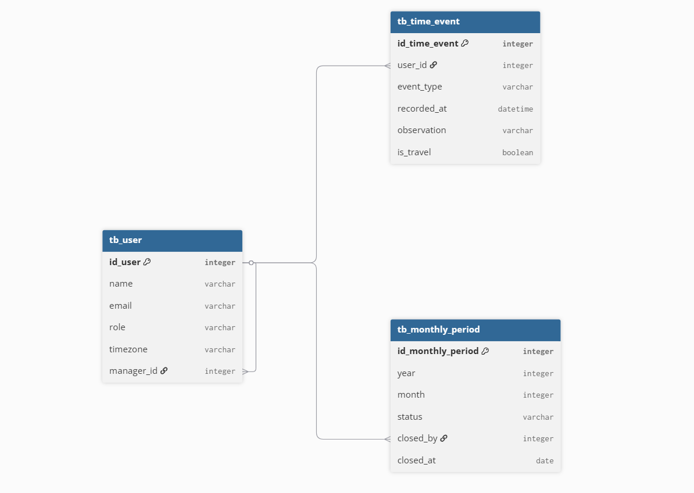

# Modelo do Banco de Dados

---

## Visão Geral

O modelo foi desenhado com base nas regras de negócio levantadas no [business-rules.md](../business-rules.md) e é composto por três entidades principais: **tb_user**, **tb_time_event** e **tb_monthly_period**.

A premissa central do modelo é separar responsabilidades claramente: o usuário existe independente de qualquer registro; os eventos de ponto existem independente de qualquer período; e o período mensal existe apenas para controlar estado de fechamento

---

## Entidades

### tb_user

Representa todos os usuários do sistema, independente do perfil. A diferenciação entre Colaborador, Gestor e RH/Admin é feita pelo campo `role`.

O campo `manager_id` é uma auto-referência, aponta para outro registro da mesma tabela, e permite representar a hierarquia entre gestor e colaborador sem a necessidade de tabelas separadas por perfil.

O `time_zone` armazena o fuso horário do colaborador no formato IANA (ex: `America/Sao_Paulo`, `Europe/Paris`), definido pelo RH no cadastro. Esse campo é a base para a exibição dos registros no horário local de cada usuário. O formato IANA foi escolhido por lidar corretamente com horário de verão, ao contrário de offsets fixos.

---

### tb_time_event

Representa cada batida de ponto realizada por um colaborador. O modelo adota registro **baseado em eventos tipados**, cada entrada, saída, início de intervalo e fim de intervalo é um registro individual com um tipo explícito.

O `recorded_at` armazena o timestamp em **UTC**. Essa é uma decisão de padronização: como a empresa opera no Brasil e na Europa, armazenar em UTC evita ambiguidades e garante consistência no banco. A conversão para o horário local é feita na camada de apresentação com base no `time_zone` do usuário.

O `timezone_at_recording` registra o fuso em que o colaborador estava **no momento da marcação**. Isso é necessário para contextos de viagem, um colaborador que viaja para a Europa registra o ponto no fuso local, e esse dado precisa ser preservado para exibição correta.

A flag `is_travel` contextualiza registros feitos em fusos diferentes do cadastrado, sinalizando que a diferença é esperada e não uma inconsistência.

---

### tb_monthly_period

Representa o período mensal de apuração e seu estado de fechamento. Essa entidade **não existe para classificar eventos de ponto**, o mês de um evento já é derivável pelo `recorded_at` do `tb_time_event`.

Ela existe para um único propósito: **carregar o estado do período** (aberto, em revisão, fechado) e registrar quem o fechou e quando.

É a partir dessa tabela que o sistema determina se um registro pode ou não ser editado. Quando o RH fecha um período, o sistema consulta o `tb_monthly_period` para bloquear qualquer alteração nos eventos daquele mês.

---

## Relacionamentos

| Relação | Tipo | Descrição |
|---------|------|-----------|
| `tb_user` → `tb_time_event` | 1:N | Um usuário possui múltiplos eventos de ponto |
| `tb_user` → `tb_user` (manager_id) | N:1 | Auto-referência para hierarquia gestor/colaborador |
| `tb_user` → `tb_monthly_period` (closed_by) | N:1 | O RH que realizou o fechamento |
| `tb_time_event` ↔ `tb_monthly_period` | implícito | Vinculados pelo `recorded_at` (ano/mês) — sem FK direta |
