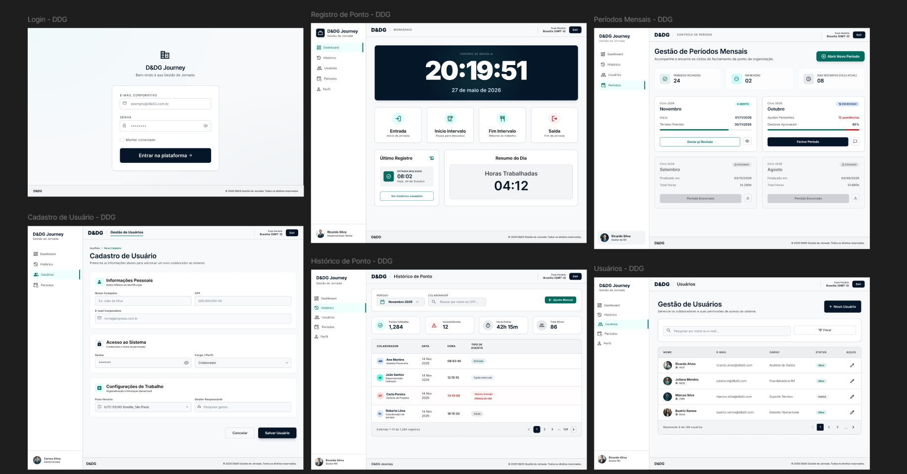

# Telas do Frontend

**Figma:** *[Clique aqui para acessar](https://www.figma.com/design/Le2hDwVbO8tJ7WK24EA6wG/Sem-t%C3%ADtulo?node-id=0-1&t=BLziEnpnjyCwaJr8-1)*

---

## Login

Tela de entrada da aplicação. Exibe o logo da DDG Journey e um formulário com campos de e-mail e senha. Acesso público, sem autenticação.

---

## Registro de Ponto

Tela principal do colaborador. Exibe o relógio em tempo real com hora atual em destaque e quatro botões de ação: Entrada, Início de Intervalo, Fim de Intervalo e Saída. Abaixo dos botões, um resumo do dia mostra o total de horas trabalhadas até o momento.

---

## Histórico de Ponto

Lista paginada dos registros de ponto do colaborador, com data, hora e tipo de evento. Possui seletor de mês no topo para filtrar o período. Gestor e RH visualizam com opções de editar ou excluir cada registro.

---

## Cadastro de Usuário

Formulário de criação e edição de colaborador, organizado em seções:
- **Informações Pessoais:** nome, e-mail, CPF
- **Acesso:** senha e cargo (Colaborador, Gestor ou RH)
- **Configurações de Timezone:** fuso horário e gestor responsável

Acessível apenas pelo RH.

---

## Gestão de Usuários

Listagem de todos os colaboradores com nome, e-mail, cargo e status. Possui botão para cadastrar novo usuário. Gestor vê apenas o próprio time. RH vê todos os colaboradores e pode editar ou desativar qualquer um.

---

## Períodos Mensais

Listagem dos meses com status visual de cada período: Aberto, Em Revisão ou Fechado. Gestor pode mover um período para Em Revisão. RH pode abrir novos períodos e realizar o fechamento. Períodos fechados bloqueiam edição de registros de ponto.
